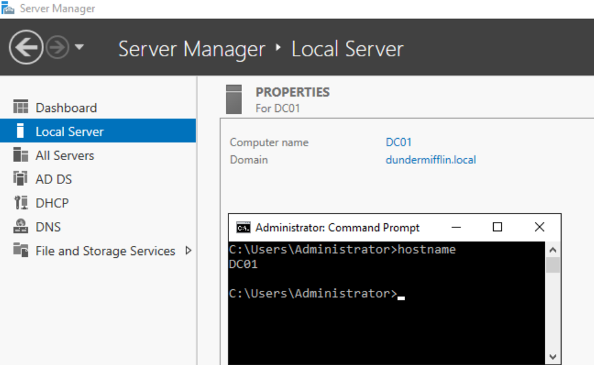
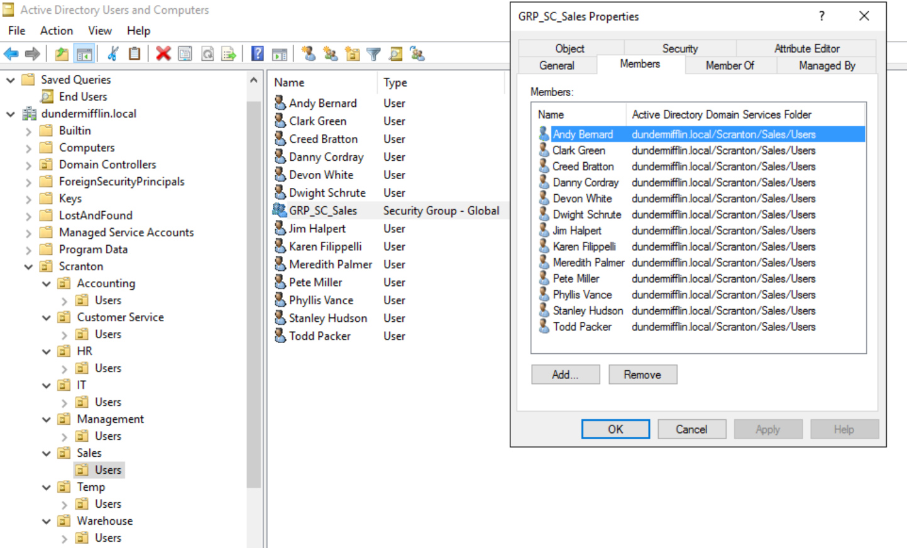
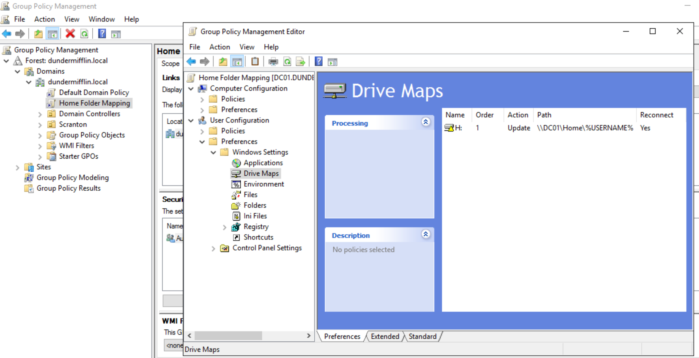
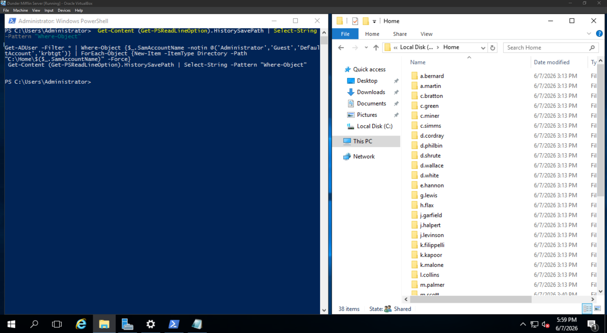
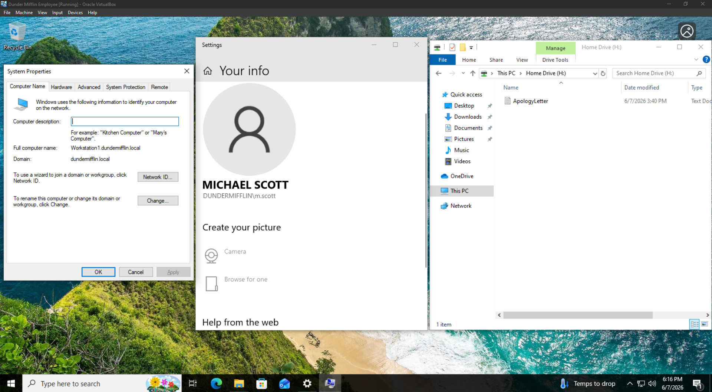

# Active Directory Homelab

## Project Overview

This project documents the creation of a Windows Server 2016 Active Directory environment based on the fictional company Dunder Mifflin from The Office.

The objective was to gain hands-on experience with Active Directory administration, Group Policy, DNS, user management, and Windows enterprise infrastructure.

## Environment

- Windows Server 2016
- Windows 10 Client
- Active Directory Domain Services
- DNS
- Group Policy

### Servers

* Windows Server 2016 Domain Controller
* Hostname: DC01
* Domain: dundermifflin.local

### Clients

* Windows 10 Domain-Joined Workstation

## Server Configuration

The Domain Controller was configured with Active Directory Domain Services and DNS.

## Active Directory Structure

This shows the OU structure, user accounts, and security groups used to organize the Dunder Mifflin environment.

### Organizational Units

* Accounting
* Customer Service
* HR
* IT
* Management
* Sales
* Temp
* Warehouse

### Security Groups

* GRP_SC_Users
* GRP_SC_Sales
* GRP_SC_Accounting
* GRP_SC_HR
* GRP_SC_IT
* GRP_SC_Warehouse
* GRP_SC_Management
* GRP_SC_CustomerService

## Tasks Completed

### Domain Services

* Installed Active Directory Domain Services
* Promoted Windows Server 2016 to Domain Controller
* Configured DNS

### User and Group Administration

* Created organizational unit structure
* Created user accounts based on Dunder Mifflin employees
* Created security groups
* Assigned users to departmental groups

### Group Policy

* Created drive mapping policy
* Mapped H: drive for all users
* Tested Group Policy deployment

## Group Policy Configuration

This GPO maps user home directories to the H: drive using the %USERNAME% variable.

### File Services

* Created Home share
* Generated home folders using PowerShell
* Configured per-user home directories

## Home Folder Automation

Automated creation of user home directories was implemented using PowerShell based on Active Directory usernames.

### Roaming Profiles

* Created roaming profile share
* Assigned profile paths to domain users

## Validation

This confirms the Windows 10 client is domain joined and successfully receiving the mapped home drive via Group Policy.

## Skills Demonstrated

* Active Directory Administration
* DNS Troubleshooting
* Group Policy Management
* Windows Server Administration
* PowerShell Automation
* User Provisioning
* File Share Permissions
* Domain Authentication

## Future Improvements

* Departmental File Shares
* Password Policies
* Account Lockout Policies
* Software Deployment via GPO
* DHCP Services
* Remote Desktop Administration
* Additional Domain Clients
* Security Hardening
