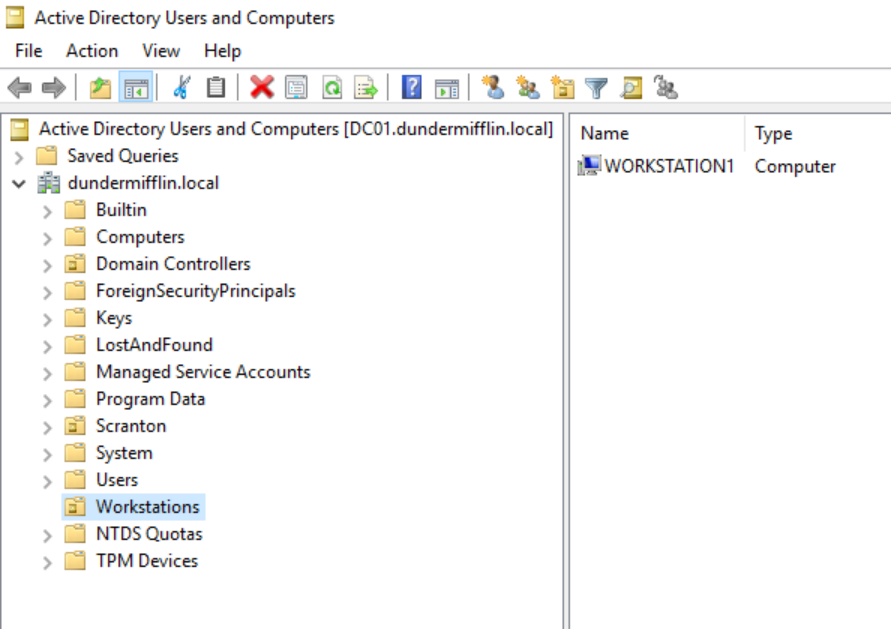

# Active Directory Configuration

## Objective

Deploy and configure an Active Directory environment for a fictional company to simulate a real-world enterprise domain.

---

## Domain Information

| Setting           | Value               |
| ----------------- | ------------------- |
| Domain Name       | dundermifflin.local |
| Domain Controller | DC01                |
| Operating System  | Windows Server 2016 |

---

## Active Directory Structure

The domain was organized using Organizational Units (OUs) to separate users by department.

### Organizational Units

* Accounting
* Customer Service
* HR
* IT
* Management
* Sales
* Temp
* Warehouse

---

## Security Groups

Department-based security groups were created to simplify permissions management.

* GRP_SC_Users
* GRP_SC_Sales
* GRP_SC_Accounting
* GRP_SC_HR
* GRP_SC_IT
* GRP_SC_Warehouse
* GRP_SC_Management
* GRP_SC_CustomerService

---

## User Management

Tasks completed:

* Created departmental Organizational Units
* Created employee user accounts
* Assigned users to department security groups
* Tested authentication and domain logins

---

## DNS Configuration

DNS was installed and configured during Active Directory deployment.

Tasks completed:

* Installed DNS role
* Verified name resolution
* Validated domain controller registration

---

## Skills Demonstrated

* Active Directory Administration
* DNS Administration
* User Provisioning
* Security Group Management
* Organizational Unit Design
