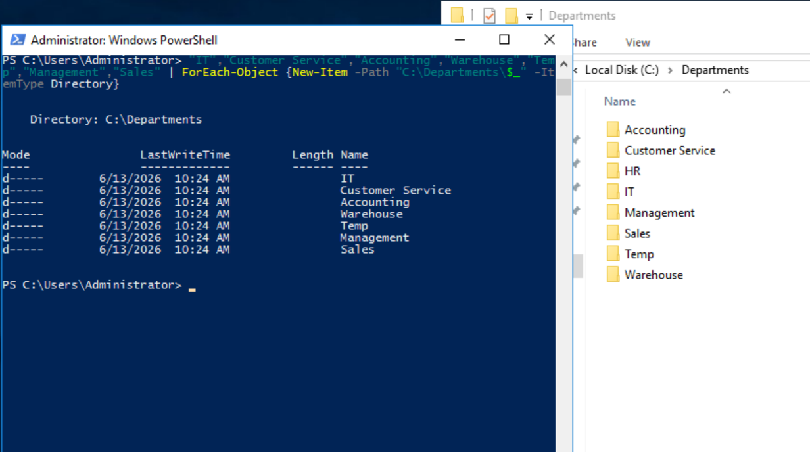
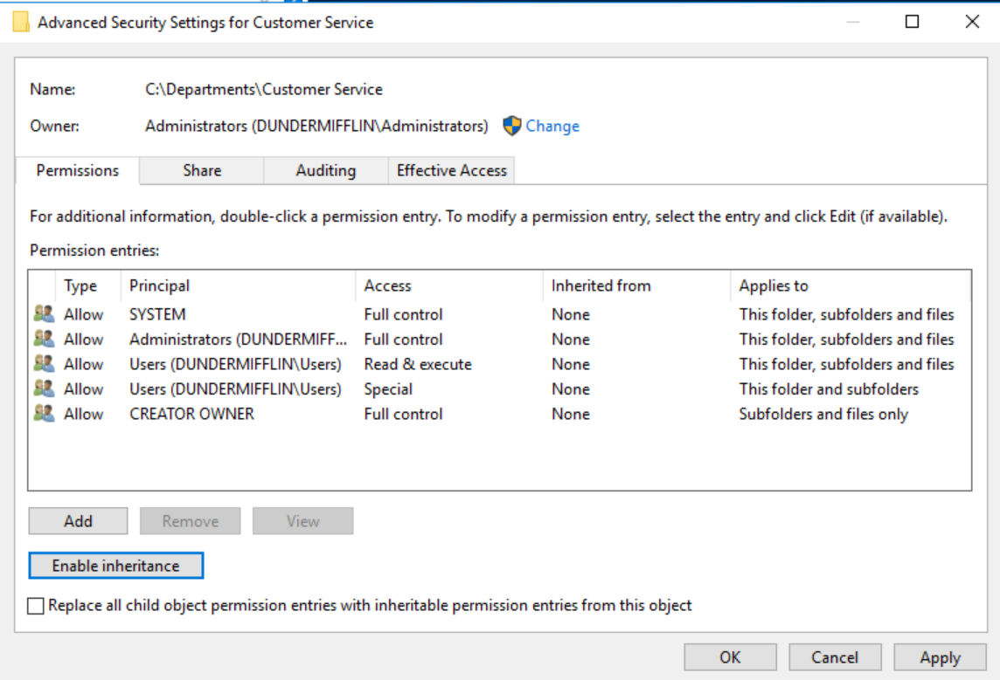
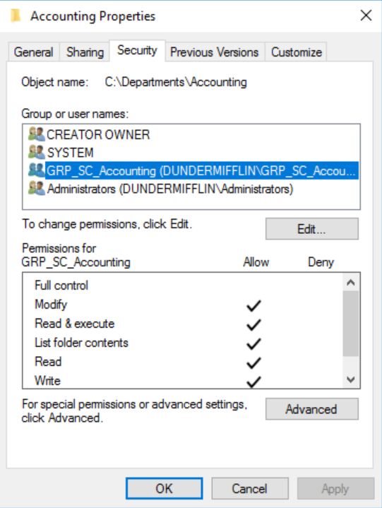
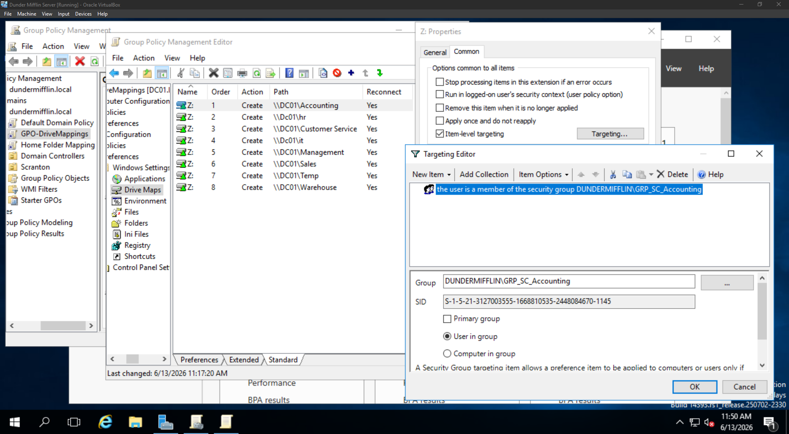
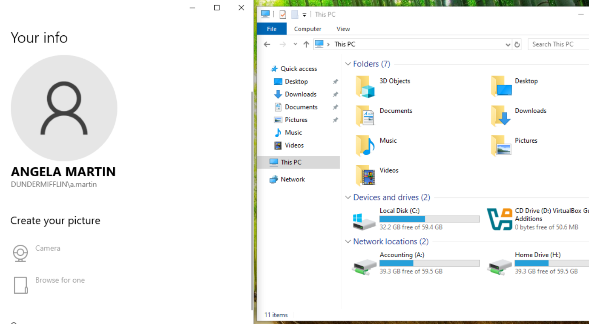
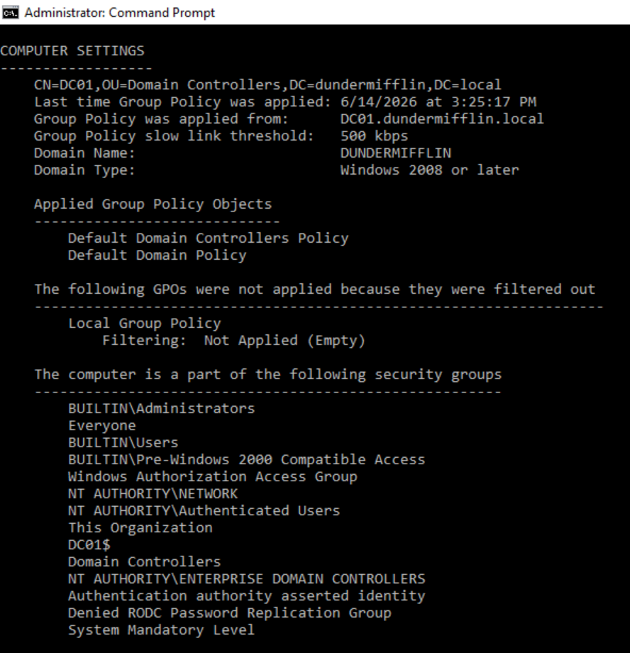

# File Services

## Objective

Configure centralized file storage for domain users using home directories and roaming profiles.

---

## Home Directories

A shared folder was created to provide each user with a dedicated home directory.

### Tasks Completed

* Created Home share
* Configured sharing permissions
* Configured NTFS permissions
* Assigned user home folders

---

## PowerShell Automation

PowerShell was used to automate home directory creation based on Active Directory usernames.

### Automation Benefits

* Reduced manual administration
* Consistent folder creation
* Faster user provisioning

---

## Roaming Profiles

Roaming profiles were configured to provide a consistent user experience across multiple systems.

### Tasks Completed

* Created roaming profile share
* Assigned profile paths
* Tested profile synchronization

---

---

## Departmental Shared Drives

Departmental shared drives were created to provide role-based access to organizational data while maintaining separation between departments.

Access was controlled through Active Directory security groups, NTFS permissions, and Group Policy drive mapping.

### Department Folder Provisioning

PowerShell was used to automate the creation of departmental folders.

Departments created:

* Accounting
* Human Resources
* Information Technology
* Sales
* Customer Service
* Management
* Reception
* Warehouse

---

### NTFS Permission Configuration

Inheritance was disabled to allow granular access control on departmental folders.

Permissions were then assigned to department-specific security groups to enforce role-based access.

---

### Group Policy Drive Mapping

Departmental drives were deployed using Group Policy Preferences.

Item-Level Targeting was configured to ensure users only received drive mappings associated with their department membership.

---

### Validation

Department users successfully received their departmental drive mappings and were able to access authorized resources.

Example validation showing an Accounting user receiving the Accounting departmental drive:

---

## Overall File Services Validation

The following components were successfully tested in the domain environment:

* Home folder creation and automatic provisioning
* User access control based on NTFS and share permissions
* Departmental drive mappings via Group Policy Preferences
* Roaming profile synchronization across domain-joined machines
* Security group-based access enforcement for file shares

Testing confirmed that users only had access to authorized departmental resources and that all file services behaved as expected under domain policy enforcement.

---

## Skills Demonstrated

* File Share Administration
* NTFS Permissions
* Share Permissions
* Security Group Management
* Group Policy Drive Mapping
* Roaming Profiles
* PowerShell Automation
* User Provisioning
* Access Control Management
