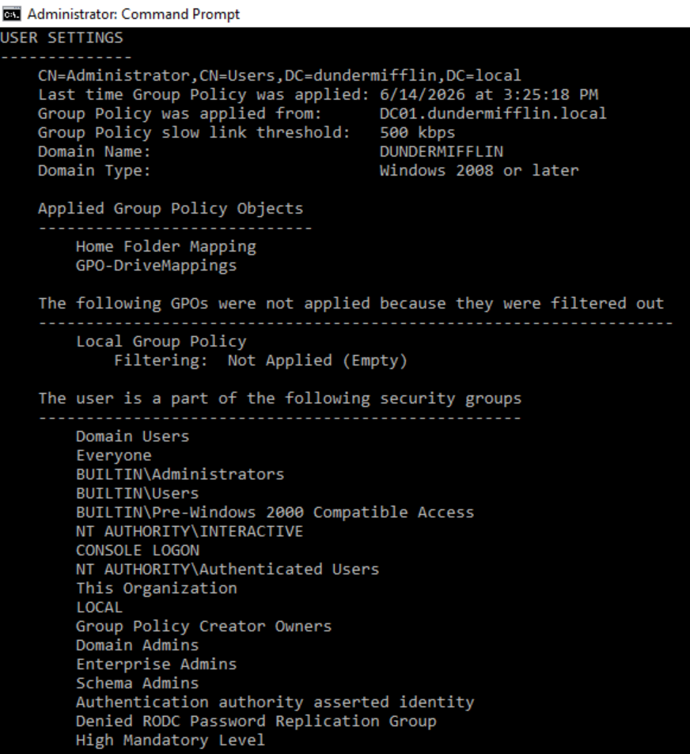

# Group Policy Configuration

## Objective

Configure Group Policy Objects (GPOs) to centrally manage user settings within the Active Directory environment.

---

## Drive Mapping Policy

A Group Policy Preference was created to automatically map user home directories.

### Configuration

* Drive Letter: H:
* Action: Update
* Path: \DC01\Home%USERNAME%

---

## Policy Validation

Validation steps performed:

* Verified Group Policy application using gpresult
* Confirmed H: drive mapping
* Confirmed correct user restrictions applied

---

## Benefits

* Centralized administration
* Consistent user experience
* Reduced manual configuration
* Automated resource assignment

---

## Skills Demonstrated

* Group Policy Management
* Drive Mapping
* Group Policy Preferences
* User Environment Configuration
