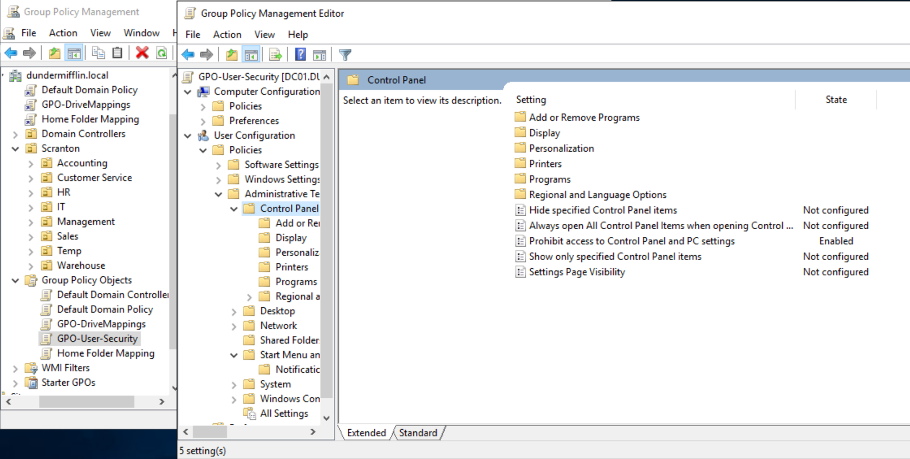
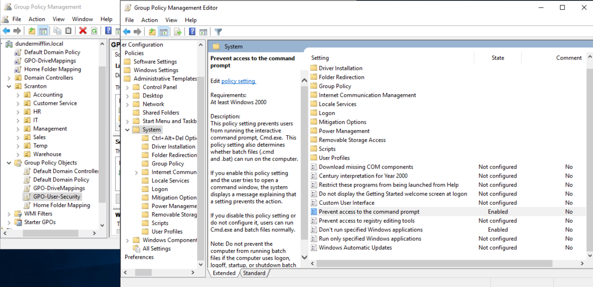
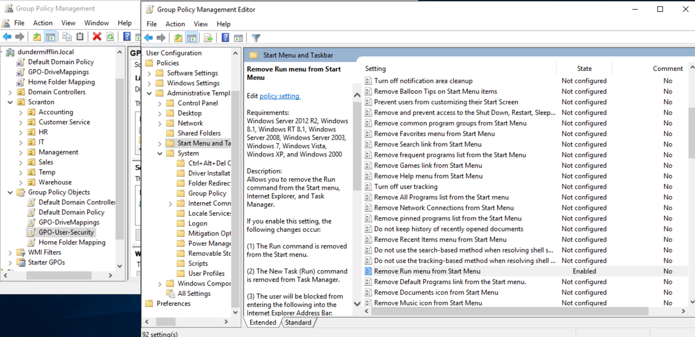
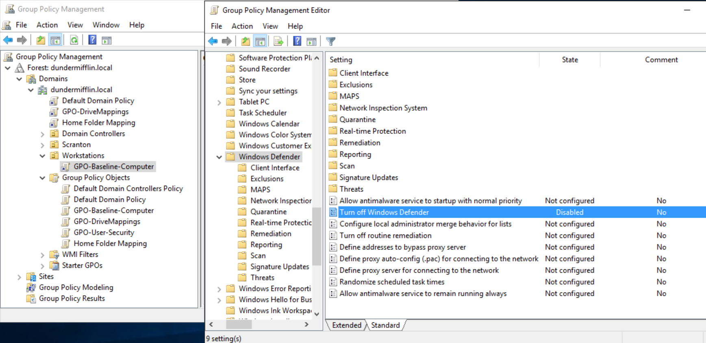
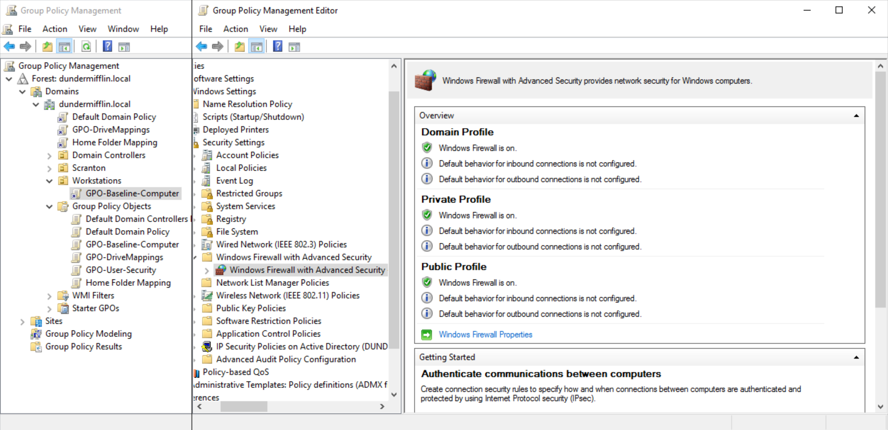
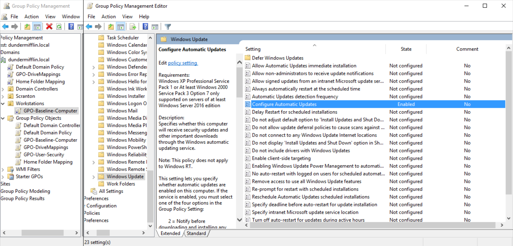

# Security Hardening

## Overview

To improve the security posture of the Active Directory environment, least privilege principles and workstation security baselines were implemented through Group Policy.

The objective was to ensure users operate with only the permissions necessary for their roles while maintaining consistent security settings across all domain-joined workstations.

---

## Least Privilege Implementation

A dedicated Group Policy Object (GPO-User-Security) was created and linked to departmental Organizational Units (OUs).

The policy was designed to reduce the attack surface available to standard users while preserving administrative access for the IT department.

### Controls Implemented

* Blocked access to Control Panel and PC Settings
* Prevented Command Prompt execution
* Prevented PowerShell execution
* Removed the Run menu from the Start Menu
* Enforced standard-user operation by removing unnecessary administrative privileges

### Validation

Control Panel restriction successfully configured through Group Policy.

Command Prompt and PowerShell restrictions successfully configured.

Run menu successfully removed through Group Policy.

---

## Local Administrator Control

Local administrative privileges were restricted through Group Policy to support least privilege practices.

Administrative access was reserved for authorized administrative accounts while standard users operated without local administrator rights.

This configuration aligns with common enterprise security practices and reduces the risk of unauthorized system modifications.

---

## Workstation Security Baseline

A dedicated workstation security baseline was implemented through a separate Group Policy Object (GPO-Baseline-Computer) linked to the Workstations Organizational Unit.

The baseline provides consistent security controls across all domain-joined workstations.

### Security Controls Implemented

* Microsoft Defender Antivirus enabled
* Windows Defender Firewall enabled
* Automatic Windows Updates configured

---

### Microsoft Defender Configuration

Microsoft Defender Antivirus was enforced through Group Policy.

---

### Windows Firewall Configuration

Firewall protection was enabled for Domain, Private, and Public profiles.

---

### Windows Update Configuration

Automatic updates were configured to maintain workstation patch compliance.

---

## Outcome

The environment now incorporates layered security controls through:

* Organizational Unit segmentation
* Security group-based access control
* Least privilege enforcement
* Workstation security baselines
* Centralized Group Policy management

These controls reflect common enterprise Active Directory administration practices and provide a foundation for future security enhancements such as AppLocker, password policies, and software deployment.
